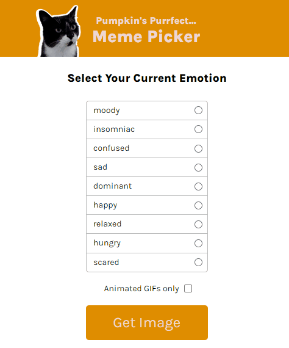

# Cat Meme Picker

**Link to project:** 

## Lessons Learned:

- .includes() array method
- .filter() array method
- using for of loop for data objects
- how to import and export
- using radio and checkbox inputs
- using querySelector
- getElementsByClassName
- classLIst.remove and add
